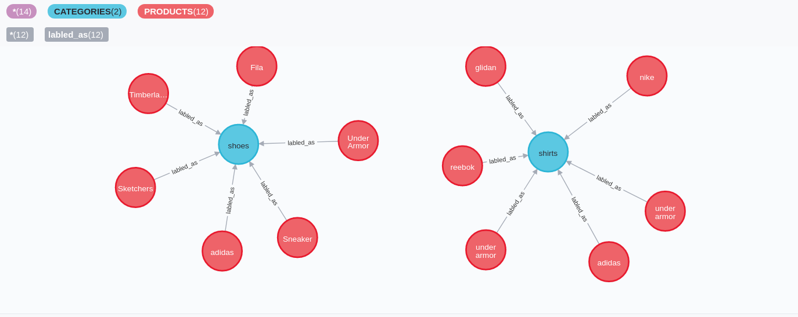

# ShoppingCatalogService

## Description
This Microservice built in Java using SpringBoot framework, with Gradle build tools.<br>
The database was configured using using neo4j to store the data.


## Usage
Product Microservice API:
<table>
    <th>Method</th>
    <th>Route</th>
    <th>Usage</th>
		<tr>
			<td><b>GET</b></td>
			<td>/shopping/categories?sortBy={sortArrt}&sortOrder={order}&page={page}&size={size}</td>
			<td> </td>
		</tr>
		<tr>
			<td><b>GET</b></td>
			<td> /shopping/products/{productId} </td>
			<td></td>
		</tr>
		<tr>
			<td><b><b>GET</b></b></td>
			<td>/shopping/products?sortBy={sortAttr}&sortOrder={order}&page={page)&size={size}</td>
			<td></td>
		</tr>
		<tr>
			<td><b>GET</b></td>
			<td>/shopping/products?filterType=byName&filterValue={productName}&sortBy={sortAttr}&sortOrder={order}&page={page)&size={size}</td>
			<td></td>
		</tr>
		<tr>
			<td><b>GET</b></td>
			<td>/shopping/products?filterType=byMinPrice&filterValue={minPrice}&sortBy={sortAttr}&sortOrder={order}&page={page)&size={size}</td>
			<td></td>
		</tr>
		<tr>
			<td><b>GET</b></td>
			<td>/shopping/products?filterType=byMaxPrice&filterValue={maxPrice}&sortBy={sortAttr}&sortOrder={order}&page={page)&size={size}</td>
			<td></td>
		</tr>
		<tr>
			<td><b>GET</b></td>
			<td>/shopping/products?filterType=byCategoryName&filterValue={categoryName}&sortBy={sortAttr}&sortOrder={order}&page={page)&size={size}</td>
			<td></td>
		</tr>
    <tr>
			<td><b>POST</b></td>
			<td>/shopping/categories</td>
			<td>An action that receives category information of products, and stores it in the system.
				If a category with this name already exists, the operation will return error code 500.</td>
		</tr>   
    <tr>
			<td><b>POST</b></td>
			<td>/shopping/products</td>
			<td></td>
		</tr>
    <tr>
			<td><b>DELETE</b></td>
			<td>/shopping</td>
			<td>An action that deletes all the products and categories that the service manages and returns nothing.</td>
		</tr>

</table>

## Neo4j Demo

<div>
        
</div>


## Product JSON Examples

```json

    {
      "id": "175",
      "name": "Adidas",
      "price": 276.12,
      "image": "http://somesite.com/adi.jpg",
      "productDetails": {
        "stock": 76,
        "discount": false,
      },
      "category": {
        "name": "shoes",
        "description":"holds all the shoes is the system"
      }
    }
    
```

## Category JSON Examples
 
```json

    {
        "name":"shoes", 
        "description":"hold all type of shoes"
    }
```
